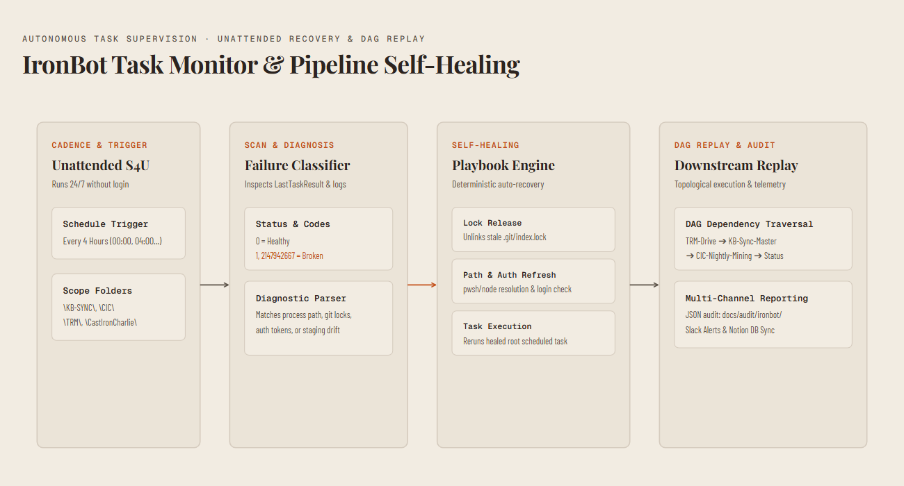
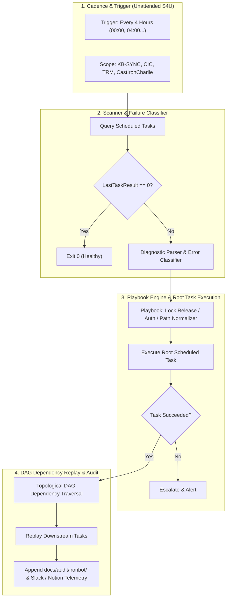

# IronBot task monitor & pipeline self-healing architecture spec

## 1. Overview
The IronBot Task Monitor (`IronBot-TaskMonitor`) is an autonomous Windows service and task supervisor designed to monitor, diagnose, repair, and replay scheduled tasks across the `\KB-SYNC\`, `\CIC\`, `\TRM\`, and `\CastIronCharlie\` namespaces. It runs every 4 hours, independent of active user sessions (configured with `LogonType: S4U` / Highest RunLevel), ensuring zero pipeline stalls due to transient crashes, lock contention, or unhandled exceptions.

---

## 2. Core operational requirements
1. **Execution cadence**: Runs every 4 hours (`00:00`, `04:00`, `08:00`, `12:00`, `16:00`, `20:00` ET).
2. **Session independence**: Configured to run whether the user is logged on or not (`LogonType: S4U` with elevated `Highest` privileges).
3. **Task scope**:
   * `\KB-SYNC\KB-Sync-Master-Pipeline`
   * `\KB-SYNC\KB-Sync-TRM-Triage`
   * `\CIC\CIC-Nightly-Notebook-Mining`
   * `\CIC\CIC-Daily-Status`
   * `\CastIronCharlie\CastIronCharlie-DailyResearch`
   * `\TRM\CIC-TRM-ClosedLoop-Nightly-Miner`
   * `\TRM\toolforge-trm-sync-treatment`
   * `\TRM\TRM-Notebooklm-Chat-Archive`
   * `\TRM\TRM-Notebooklm-Mine`
4. **Self-healing pipeline**:
   * Inspects task `LastTaskResult` and execution timestamps.
   * Diagnoses root causes via exit codes and log files.
   * Executes deterministic playbooks (stale lock release, git state repair, auth refresh, directory verification).
5. **DAG-based dependency replay**:
   * When a broken root task succeeds after healing, triggers all downstream dependent tasks in topological order.
6. **Logging & multi-channel reporting**:
   * Appends structured JSON/Markdown audit entries to `docs/audit/ironbot/`.
   * Dispatches incident and recovery notifications to Slack webhook.
   * Updates Notion operations database.

---

## 3. Architecture & components

Mermaid source

---

## 4. Task dependency graph (DAG)

| Task Name | Task Path | Depends On | Triggers Downstream |
| :--- | :--- | :--- | :--- |
| `toolforge-trm-sync-treatment` | `\TRM\` | None (Root) | `KB-Sync-Master-Pipeline` |
| `KB-Sync-Master-Pipeline` | `\KB-SYNC\` | `toolforge-trm-sync-treatment` | `CIC-Nightly-Notebook-Mining` |
| `CIC-Nightly-Notebook-Mining` | `\CIC\` | `KB-Sync-Master-Pipeline` | `CIC-Daily-Status` |
| `CastIronCharlie-DailyResearch` | `\CastIronCharlie\` | None (Root) | `CIC-Nightly-Notebook-Mining` |
| `KB-Sync-TRM-Triage` | `\KB-SYNC\` | None (Independent) | None |

---

## 5. Playbook self-healing matrix

| Exit Code / Symptom | Identified Root Cause | Automated Playbook Action |
| :--- | :--- | :--- |
| `2147942667` | Executable path missing / process crash | Re-registers task with resolved absolute `pwsh.exe` / `node.exe` paths |
| `1` (Git Lock) | `.git/index.lock` or `.git/MERGE_HEAD` present | Tests lock file age (>10m) and removes stale lock |
| `1` (Auth Expired) | NotebookLM / Google Drive auth token expired | Executes `nlm login --check` / Drive API token refresh |
| `1` (Drive Unreachable) | Drive streaming mount unmounted in non-interactive session | Checks alternative local path `%USERPROFILE%\Google Drive` |
| `1` (Wiki Drift / DAG) | Staging validation or DAG broken | Executes `npm run kb:dag:recover` and `npm run wiki:ingest:offline` |

---

## 6. Implementation plan & file layout

1. `scripts/ironbot/ironbot-task-monitor.ps1`: Primary PowerShell orchestrator running scan, healing, DAG replay, and reporting.
2. `scripts/ironbot/ironbot-playbooks.mjs`: Node-based diagnostic log parser, error categorizer, and recovery playbook executor.
3. `scripts/ironbot/task-dag-definitions.json`: Declarative JSON configuration mapping task dependencies, log locations, and playbooks.
4. `scripts/ironbot/register-ironbot-task.ps1`: Windows Task Scheduler registration script configuring unattended S4U execution every 4 hours.
5. `tests/ironbot-task-monitor.test.mjs`: Test suite validating DAG resolution, playbook selection, and mock recovery workflows.
