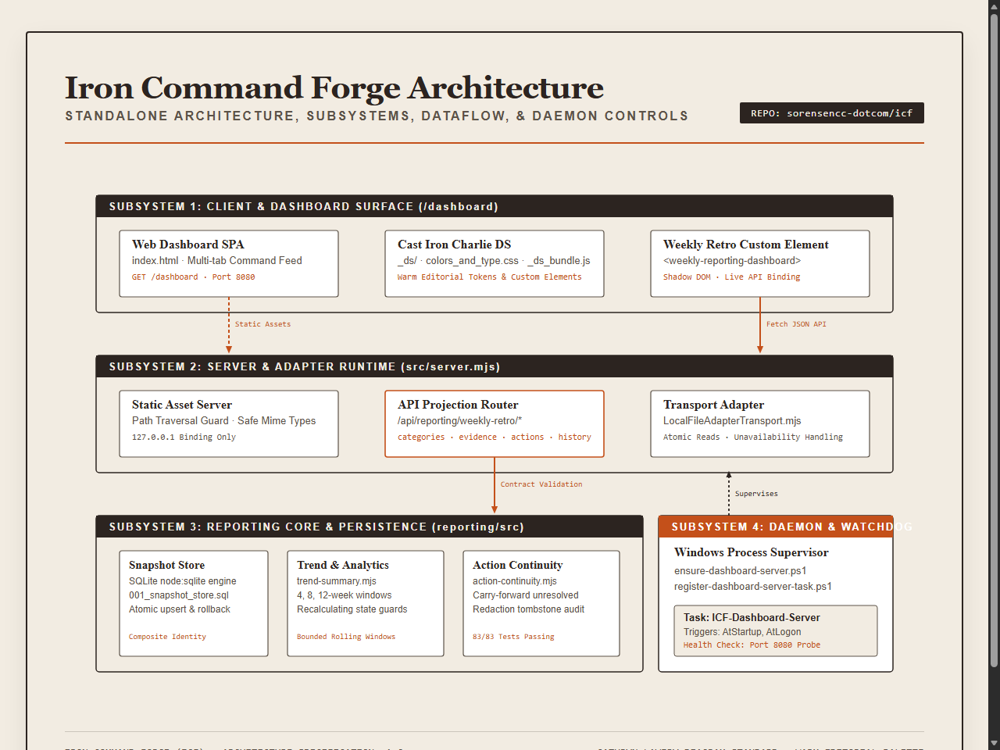
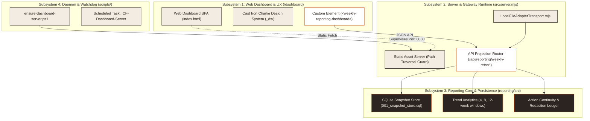

# Iron Command Forge Architecture

**Type:** Architecture  
**Domain:** operations, reporting, telemetry, dashboard  
**Status:** Active  
**Repository:** `C:\dev\icf` (`sorensencc-dotcom/icf`)  
**Last Updated:** 2026-09-19  

---

## Definition

Iron Command Forge (ICF) is the centralized operations, reporting, telemetry aggregation, and dashboard platform for the developer workspace. ICF combines an SQLite-backed reporting engine with bounded trend projection, a multi-tab operations dashboard powered by the Cast Iron Charlie design system, an HTTP static and API gateway server, and Windows background daemon supervision.

---

## Architecture diagram



<details>
<summary>Mermaid source...</summary>



</details>

---

## Core subsystems

### 1. Web dashboard surface (`/dashboard`)
The web dashboard provides a unified view of daily pipeline runs, telemetry feeds, ingestion DAG status, and weekly retrospectives.
- **Visual Design**: Uses the Cast Iron Charlie design system (`_ds/`) with warm editorial typography (`Playfair Display`, `Barlow Condensed`, and `Geist Mono`).
- **Web Component**: Embeds `<weekly-reporting-dashboard>` to consume reporting API projections and render executive summary cards, review canvases, evidence drill-down panels, and action ledgers.

### 2. HTTP gateway and adapter runtime (`src/server.mjs`)
The server runtime binds strictly to `127.0.0.1:8080` to prevent unauthorized cross-origin access.
- **Static File Delivery**: Verifies filesystem paths against directory traversal before reading or streaming assets.
- **API Projections**: Exposes dedicated endpoints for `/api/reporting/weekly-retro`, `/categories`, `/evidence`, `/actions`, `/history`, and `/routing`.
- **Adapter Layer**: Utilizes `LocalFileAdapterTransport.mjs` to execute atomic reads and surface structured availability statuses (`SUCCESS`, `UNAVAILABLE`, or `TREND_RECALCULATING`).

### 3. Reporting core and snapshot store (`reporting/src`)
The reporting engine maintains historical telemetry and action accountability using embedded SQLite (`node:sqlite`).
- **Snapshot Persistence**: Stores raw report envelopes and computed summaries across composite keys (source system, source, week, and category).
- **Trend Computation**: Evaluates rolling performance across 4-week, 8-week, and 12-week windows with explicit empty-window and partial-state classifications.
- **Action Continuity**: Tracks remediation items across weekly cycles, managing carry-forwards, completions, and redaction tombstones across 83 verified unit tests.

### 4. Background daemon supervision (`scripts/`)
Windows Scheduled Tasks maintain service availability without requiring manual terminal restarts.
- **Watchdog Script**: `scripts/ensure-dashboard-server.ps1` probes `http://127.0.0.1:8080` and starts the Node.js background process when uncontactable.
- **Scheduled Task Registration**: `scripts/register-dashboard-server-task.ps1` configures automatic startup at system boot and user login.

---

## Operating procedures

### Starting the server
To start the standalone server manually, run the following command from the repository root:
```powershell
npm run start
```

### Running test suites
To execute the reporting contract and unit test suite (83 tests), run:
```powershell
npm test
```

### Verifying repository context
To validate repository preflight conformance, execute:
```powershell
pwsh -NoProfile -File C:\dev\scripts\verify-repo-context.ps1 -Path C:\dev\icf
```

---

## Related concepts

- [[kb-sync/concepts/three-layer-vault-architecture|Three-Layer Vault Architecture]] — Foundation for knowledge base separation
- [[kb-sync/concepts/deterministic-sync-pipeline|Deterministic Sync Pipeline]] — Ingestion and synchronization mechanisms
- [[kb-sync/concepts/fail-soft-orchestration|Fail-Soft Orchestration]] — Resilient execution patterns across agent tasks
