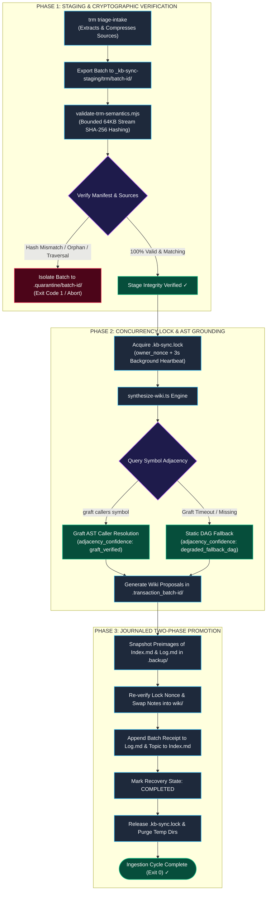
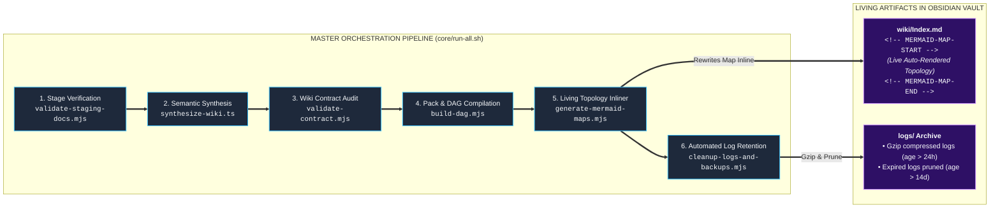

# 🧠 Complete System Architecture: Second Brain, TRM & Knowledge Mesh

> [!NOTE]
> **Executive Architecture Model**: This document provides a high-fidelity visual blueprint of the unified knowledge mesh spanning **`C:/dev/trm`** (Multimodal Mining & Triage), **`C:/dev/kb-sync`** (Three-Layer Knowledge Vault & AST Graph), and distribution targets (**Obsidian Vault** & **NotebookLM Pack**).

---

## 1. High-Level Multi-Repository Ecosystem

```mermaid
flowchart TB
    subgraph PRODUCER ["PRODUCER: TOPIC RESEARCH MINING (trm)"]
        direction TB
        P_IN["Multimodal Ingestion Feeds<br/>(PDF, EPUB, Web, Docs, Images)"]
        P_TRIAGE["TRM Triage & Compaction Engine<br/><code>src/cli/commands/triageIntake.ts</code>"]
        P_SCHEMA["Schema Contract Gate (v2.3.0)<br/><code>Ajv / JSON Schema Draft 2020-12</code>"]
        P_EXPORT["Content-Addressed Staging Exporter<br/><code>npm run triage:export:staging</code>"]

        P_IN --> P_TRIAGE --> P_SCHEMA --> P_EXPORT
    end

    subgraph STAGING ["LAYER 1: CONTENT-ADDRESSED STAGING BUFFER"]
        direction TB
        S_DIR["_kb-sync-staging/trm/batch-id/<br/>├── payload.json (Concepts & Metadata)<br/>├── sources.manifest.json (SHA-256 Index)<br/>└── sources/ (Flat *.md, *.pdf, *.epub)"]
        
        S_VAL["Single-Pass Stream Semantic Validator<br/><code>modules/wiki/validate-trm-semantics.mjs</code><br/>• 64KB chunked SHA-256 stream hashing<br/>• Strict source-ID binding: src-id.ext<br/>• Zero-orphan enforcement & traversal guard"]

        S_DIR --> S_VAL
    end

    subgraph CONSUMER ["LAYER 2: THREE-LAYER VAULT & AST GROUNDING (kb-sync)"]
        direction TB
        C_LOCK["Concurrency Lock Manager<br/><code>.kb-sync.lock (owner_nonce + 3s Heartbeat)</code>"]
        C_SYNTH["Headless Synthesis Engine<br/><code>modules/obsidian/synthesize-wiki.ts</code>"]
        
        subgraph AST_GROUNDING ["Codebase AST Grounding Subsystem"]
            G_BIN["Trusted Graft Compiler CLI<br/><code>graft.cmd callers symbol</code>"]
            G_DAG["Static DAG Adjacency Cache<br/><code>.nlm_pack/generations/dag.json</code>"]
            G_BIN -.->|Fallback on Timeout| G_DAG
        end

        C_WAL["Two-Phase Journaled WAL Promotion<br/><code>.recovery-manifest.json</code><br/>• Preimages of Index.md & Log.md<br/>• Atomic file promotion & rollback"]

        C_LOCK --> C_SYNTH
        C_SYNTH <--> AST_GROUNDING
        C_SYNTH --> C_WAL
    end

    subgraph TARGETS ["LAYER 3: DISTRIBUTION TARGETS & PERSISTENCE"]
        direction TB
        T_OBS["Obsidian Vault (wiki/)<br/>├── research/slug.md (Deep Dives)<br/>├── concepts/slug.md (Concepts)<br/>├── Index.md (Living Topology Map)<br/>└── Log.md (Audit Receipts)"]
        T_NLM["Compacted Knowledge Pack<br/><code>.nlm_pack/repo_knowledge_pack.txt</code>"]
        T_QUAR["Quarantine Isolation Vault<br/><code>.quarantine/batch-id/</code>"]
    end

    P_EXPORT ==>|Stage Validated Batch| S_DIR
    S_VAL ==>|Integrity Verified (Exit 0)| C_LOCK
    S_VAL -.->|Checksum Error (Exit 1)| T_QUAR
    C_WAL ==>|Atomic Promotion| T_OBS
    C_WAL ==>|Compiled Knowledge Sync| T_NLM

    classDef prodNode fill:#1e293b,stroke:#38bdf8,stroke-width:1.5px,color:#f8fafc;
    classDef stageNode fill:#1e1b4b,stroke:#a855f7,stroke-width:1.5px,color:#f8fafc;
    classDef synthNode fill:#064e3b,stroke:#10b981,stroke-width:1.5px,color:#f8fafc;
    classDef targetNode fill:#3b0717,stroke:#f43f5e,stroke-width:1.5px,color:#f8fafc;
    classDef astNode fill:#047857,stroke:#6ee7b7,stroke-width:1.5px,color:#f8fafc;

    class P_IN,P_TRIAGE,P_SCHEMA,P_EXPORT prodNode;
    class S_DIR,S_VAL stageNode;
    class C_LOCK,C_SYNTH,C_WAL synthNode;
    class G_BIN,G_DAG astNode;
    class T_OBS,T_NLM,T_QUAR targetNode;
```

---

## 2. Ingestion & Semantic Verification Pipeline



---

## 3. Concurrency Lock & Crash Recovery State Machine

```mermaid
flowchart TD
    subgraph LOCK_FLOW ["LOCK ACQUISITION & CONTENTION"]
        UNLOCKED(["UNLOCKED (Engine Idle)"]) -->|Open .kb-sync.lock with wx flag| ATTEMPT_LOCK{"Acquire Lock"}
        ATTEMPT_LOCK -->|Success| LOCKED["LOCK_ACQUIRED (owner_nonce + heartbeat)"]
        ATTEMPT_LOCK -->|EEXIST Collision| COLLISION["LOCK_COLLISION"]
        COLLISION -->|Check PID Liveness > 15s| STALE_CHECK{"Is Lock Stale?"}
        STALE_CHECK -->|Dead PID| RECLAIM["Reclaim Stale Lock"] --> LOCKED
        STALE_CHECK -->|Active PID| ABORT_RUN(["Abort / Retry Later"])
    end

    subgraph TRANSACTION_FLOW ["TWO-PHASE PROMOTION PIPELINE"]
        LOCKED --> STAGING["1. Staging Structure Check"]
        STAGING --> VALIDATING["2. Bounded Stream SHA-256 Check"]
        VALIDATING --> SYNTHESIZING["3. Generate Notes in .transaction/"]
        SYNTHESIZING --> COMMITTING_FILES["4. Record Preimages in WAL"]
        COMMITTING_FILES --> COMMITTING_INDEX["5. Atomic Swap Notes into wiki/"]
        COMMITTING_INDEX --> COMPLETED["6. Append Log.md & Index.md"]
        COMPLETED --> CLEANUP["7. Purge Temp Dirs & Release Lock"]
        CLEANUP --> UNLOCKED
    end

    subgraph RECOVERY_FLOW ["STARTUP CRASH RECOVERY (WAL)"]
        CRASH_DETECTED["Startup Recovery: .recovery-manifest.json Detected"] --> CHECK_STATE{"Check WAL State"}
        CHECK_STATE -->|State: COMMITTING_FILES| ROLLBACK["Rollback: Delete created files & restore backup preimages"]
        CHECK_STATE -->|State: COMMITTING_INDEX| REPLAY["Replay: Idempotently replay Index/Log appends"]
        ROLLBACK --> CLEAN_RECOVERED["Mark RECOVERED & Release Lock"] --> UNLOCKED
        REPLAY --> CLEAN_RECOVERED
    end

    COMMITTING_FILES -.->|Process Killed (SIGKILL)| CRASH_DETECTED
    COMMITTING_INDEX -.->|Process Killed (SIGKILL)| CRASH_DETECTED

    classDef normal fill:#1e293b,stroke:#38bdf8,stroke-width:1.5px,color:#f8fafc;
    classDef active fill:#064e3b,stroke:#10b981,stroke-width:1.5px,color:#f8fafc;
    classDef warning fill:#451a03,stroke:#f59e0b,stroke-width:1.5px,color:#f8fafc;
    classDef danger fill:#4c0519,stroke:#f43f5e,stroke-width:1.5px,color:#f8fafc;

    class UNLOCKED,LOCKED,STAGING,VALIDATING,SYNTHESIZING normal;
    class COMMITTING_FILES,COMMITTING_INDEX,COMPLETED,CLEANUP active;
    class COLLISION,STALE_CHECK,RECLAIM,CHECK_STATE warning;
    class ABORT_RUN,CRASH_DETECTED,ROLLBACK,REPLAY danger;
```

---

## 4. Master Orchestration & Living CodeWiki Topology Flow



---

## 5. Architectural Guardrails & Invariants Matrix

| Architectural Layer | Enforcing Module | Critical Invariant | Fail-Closed Behavior |
| :--- | :--- | :--- | :--- |
| **Layer 1: Staging** | [`validate-trm-semantics.mjs`](../modules/wiki/validate-trm-semantics.mjs) | Stream digests match `sources.manifest.json`; zero orphans; no path traversal. | Batch isolated in `.quarantine/batch-id/` (Exit 1). |
| **Layer 2: Synthesis** | [`synthesize-wiki.ts`](../modules/obsidian/synthesize-wiki.ts) | Canonical vault boundaries (`wiki/research/`, `wiki/concepts/`); 512 KB source text cap. | Aborts proposal batch; rolls back temp workspace. |
| **AST Grounding** | [`synthesize-wiki.ts`](../modules/obsidian/synthesize-wiki.ts) | Windows-safe `where.exe graft.cmd` resolution with 5000ms timeout. | Falls back to static `.nlm_pack` DAG with `[WARN:DEGRADED]`. |
| **Crash Safety** | [`synthesize-wiki.ts`](../modules/obsidian/synthesize-wiki.ts) | Atomic `.kb-sync.lock` (`O_EXCL`) + preimage journaling of `Index.md` / `Log.md`. | Replays commit or restores backup preimages on startup. |
| **Wiki Contract** | [`validate-contract.mjs`](../modules/wiki/validate-contract.mjs) | Links match `[[kb-sync/wiki/(research\|concepts)/slug]]`; body citations match frontmatter. | Blocks commit via git pre-commit hook (Exit 1). |
| **Living Topology** | [`generate-mermaid-maps.mjs`](../scripts/generate-mermaid-maps.mjs) | Delimited in-place replacement of Mermaid chart in `wiki/Index.md`. | Fail-soft (logs warning in `run-all.sh`, does not fail sync). |
| **Log Maintenance** | [`cleanup-logs-and-backups.mjs`](../scripts/cleanup-logs-and-backups.mjs) | Gzip compress logs older than 24h; purge files older than 14d. | Cleans partial `.gz` files on error; preserves newest 5 packs. |
