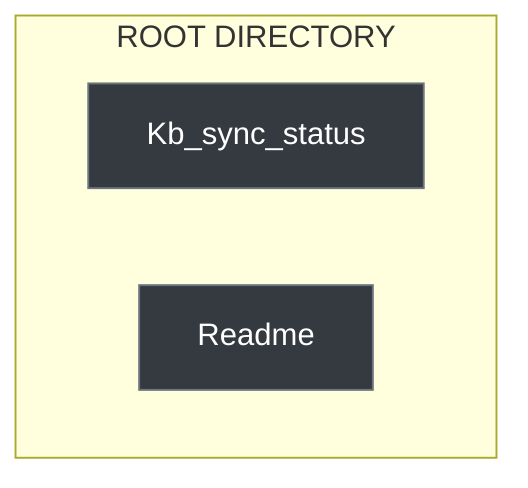

# Wiki Index

## Pages
- [[kb-sync/wiki/202607211]]
- [[kb-sync/wiki/202608011]]
- [[kb-sync/wiki/CoverageReport]]
- [[kb-sync/wiki/DriftReport]]
- [[kb-sync/wiki/Env]]
- [[kb-sync/wiki/GithubWorkflowsTestSuite]]
- [[kb-sync/wiki/ValidateStaging]]
- [[kb-sync/wiki/GithubWorkflowsWeeklyReviewCapacity]]
- [[kb-sync/wiki/IjfwDreamStateV2]]
- [[kb-sync/wiki/IjfwDreamState]]
- [[kb-sync/wiki/Ijfw]]
- [[kb-sync/wiki/Ijfw]]
- [[kb-sync/wiki/Ijfw]]
- [[kb-sync/wiki/ProjectJournal]]
- [[kb-sync/wiki/IjfwMetricsTranscriptCursor]]
- [[kb-sync/wiki/IjfwMetricsSessions]]
- [[kb-sync/wiki/Session20260723010038]]
- [[kb-sync/wiki/Session20260726020004]]
- [[kb-sync/wiki/Session20260730231936]]
- [[kb-sync/wiki/Progress]]
- [[kb-sync/wiki/SyncStatus]]
- [[kb-sync/wiki/CHANGELOG]]
- [[kb-sync/wiki/CLAUDE]]
- [[kb-sync/wiki/CROSSPLATFORMTESTCHECKLIST]]
- [[kb-sync/wiki/PIPELINEEXECUTIONREPORT]]
- [[kb-sync/wiki/README]]
- [[kb-sync/wiki/REVIEW]]
- [[kb-sync/wiki/SYNCFAILURE20260720]]
- [[kb-sync/wiki/VERSION]]
- [[kb-sync/wiki/ArtifactGenerator.Sh]]
- [[kb-sync/wiki/Global]]
- [[kb-sync/wiki/Notebooklm]]
- [[kb-sync/wiki/Obsidian]]
- [[kb-sync/wiki/Webhooks]]
- [[kb-sync/utilities/Chunk]]
- [[kb-sync/wiki/CoreDag]]
- [[kb-sync/utilities/Flatten]]
- [[kb-sync/wiki/PathNormalizer]]
- [[kb-sync/utilities/Rollback]]
- [[kb-sync/utilities/RunAll]]
- [[kb-sync/utilities/Validate]]
- [[kb-sync/wiki/CROSSPLATFORMTESTING]]
- [[kb-sync/wiki/IMPLEMENTATIONRECORDKBSYNCTIMEOUTPOLICY20260722]]
- [[kb-sync/wiki/README]]
- [[kb-sync/wiki/SESSIONWRAPUP20260726]]
- [[kb-sync/wiki/ArchiveCleanup]]
- [[kb-sync/wiki/GithubActionsSetup]]
- [[kb-sync/wiki/AutomationPolicy]]
- [[kb-sync/wiki/SkillApprovalRules]]
- [[kb-sync/wiki/Architecture]]
- [[kb-sync/wiki/Authentication]]
- [[kb-sync/wiki/ErrorBoundaries]]
- [[kb-sync/wiki/OperatorRules]]
- [[kb-sync/wiki/Pipeline]]
- [[kb-sync/wiki/ArtifactGenerator.Sh]]
- [[kb-sync/wiki/KbSyncNightlyAudit]]
- [[kb-sync/wiki/202607152134]]
- [[kb-sync/wiki/KbSyncNightly20260717FINAL]]
- [[kb-sync/wiki/Headless-Synthesis-Worker]]
- [[kb-sync/wiki/RepairProvider.Mjs]]
- [[kb-sync/wiki/CreateALink]]
- [[kb-sync/wiki/RoadmapSync20260719]]
- [[kb-sync/wiki/ObsidianVaultWikiCatalog]]
- [[kb-sync/wiki/Index]]
- [[kb-sync/Log]]
- [[kb-sync/concepts/deterministic-sync-pipeline]]
- [[kb-sync/concepts/fail-soft-orchestration]]
- [[kb-sync/concepts/karpathy-llm-wiki-pattern]]
- [[kb-sync/concepts/manifest-mode]]
- [[kb-sync/concepts/pack-based-knowledge-management]]
- [[kb-sync/concepts/raw-source-staging]]
- [[kb-sync/wiki/SemanticIngestWorkflow]]
- [[kb-sync/wiki/ThreeLayerVaultArchitecture]]
- [[kb-sync/wiki/Index]]
- [[kb-sync/wiki/SkillApprovalRules]]
- [[kb-sync/wiki/KBSyncOrchestration]]
- [[kb-sync/wiki/PathNormalization]]
- [[kb-sync/wiki/RetryAndTimeout]]
- [[kb-sync/wiki/ArtifactGenerator.Sh]]
- [[kb-sync/entities/chunk.sh]]
- [[kb-sync/entities/flatten.sh]]
- [[kb-sync/wiki/Index]]
- [[kb-sync/entities/rollback.sh]]
- [[kb-sync/entities/run-all.sh]]
- [[kb-sync/entities/validate.sh]]
- [[kb-sync/wiki/WikiLintRules]]
- [[kb-sync/wiki/WikiOperatorWorkflow]]
- [[kb-sync/wiki/WikiSchema]]
- [[kb-sync/wiki/WikiUpdateRules]]
- [[kb-sync/wiki/Index]]
- [[kb-sync/entities/ingest-notebooklm.sh]]
- [[kb-sync/entities/kb-sync-nightly.sh]]
- [[kb-sync/entities/register-kb-sync-task.ps1]]
- [[kb-sync/wiki/Index]]
- [[kb-sync/entities/ingest-obsidian.sh]]
- [[kb-sync/wiki/Index]]
- [[kb-sync/entities/ingest-wiki.sh]]
- [[kb-sync/wiki/PackageLock]]
- [[kb-sync/wiki/Package]]
- [[kb-sync/wiki/Pyragify]]
- [[kb-sync/wiki/ScheduleTaskWrapperKBSyncCleanupArchives]]
- [[kb-sync/wiki/$TaskName]]
- [[kb-sync/wiki/WikiContractBackfill]]
- [[kb-sync/wiki/ReviewCapacity.Test]]
- [[kb-sync/wiki/TestsSchemaValidationTest]]
- [[kb-sync/wiki/TestsSynthesizeWorkerVerification]]
- [[kb-sync/utilities/TestWslPathNormalization]]
- [[kb-sync/wiki/TestsValidateContractJsonTest]]
- [[kb-sync/wiki/ValidateStagingV12Features]]
- [[kb-sync/wiki/WeeklyReviewCapacityWorkflow.Test]]
- [[kb-sync/wiki/WikiContractCleanupVerification]]
- [[kb-sync/wiki/VitestConfig]]
- [[kb-sync/wiki/WikiCatalog]]
- [[kb-sync/wiki/Index]]
- [[kb-sync/Log]]
- [[kb-sync/concepts/deterministic-sync-pipeline]]
- [[kb-sync/concepts/fail-soft-orchestration]]
- [[kb-sync/concepts/immutable-staging]]
- [[kb-sync/concepts/karpathy-llm-wiki-pattern]]
- [[kb-sync/concepts/manifest-mode]]
- [[kb-sync/concepts/pack-based-knowledge-management]]
- [[kb-sync/concepts/raw-source-staging]]
- [[kb-sync/entities/audit-coverage.ts]]
- [[kb-sync/entities/autofill-frontmatter.mjs]]
- [[kb-sync/entities/check-status.mjs]]
- [[kb-sync/entities/chunk.sh]]
- [[kb-sync/entities/cleanup-logs-and-backups.mjs]]
- [[kb-sync/entities/cleanup-pack-dir.sh]]
- [[kb-sync/entities/cleanup-staging-archives.mjs]]
- [[kb-sync/entities/compute-weekly-metrics.ps1]]
- [[kb-sync/entities/detect-drift.ts]]
- [[kb-sync/entities/extract-github-prs.ps1]]
- [[kb-sync/entities/flatten.sh]]
- [[kb-sync/entities/generate-delta-summary.ts]]
- [[kb-sync/entities/generate-kb-sync-artifact.js]]
- [[kb-sync/entities/generate-kb-sync-artifact.mjs]]
- [[kb-sync/entities/generate-kb-sync-artifact.ts]]
- [[kb-sync/entities/generate-report.mjs]]
- [[kb-sync/entities/generate.sh]]
- [[kb-sync/entities/ingest-notebooklm.sh]]
- [[kb-sync/entities/ingest-obsidian.sh]]
- [[kb-sync/entities/ingest-wiki.sh]]
- [[kb-sync/entities/kb-sync-nightly.ps1]]
- [[kb-sync/entities/kb-sync-nightly.sh]]
- [[kb-sync/entities/path-normalizer-verification.ts]]
- [[kb-sync/wiki/Core/PathNormalizer.Mjs]]
- [[kb-sync/entities/post-commit-hook-example.sh]]
- [[kb-sync/entities/register-kb-sync-task.ps1]]
- [[kb-sync/entities/rollback.sh]]
- [[kb-sync/entities/run-all.sh]]
- [[kb-sync/entities/schedule-task-wrapper-KB-Sync-Wiki-Automate.ps1]]
- [[kb-sync/entities/secret-scan-hook.sh]]
- [[kb-sync/entities/setup-auth.mjs]]
- [[kb-sync/entities/setup-scheduled-tasks.ps1]]
- [[kb-sync/entities/validate-contract.mjs]]
- [[kb-sync/entities/validate-staging-docs.mjs]]
- [[kb-sync/entities/validate.sh]]
- [[kb-sync/entities/wiki-contract-backfill.mjs]]
- [[kb-sync/entities/wiki-validate-precommit.sh]]

### System Topology Map

<!-- MERMAID-MAP-START -->

<!-- MERMAID-MAP-END -->
