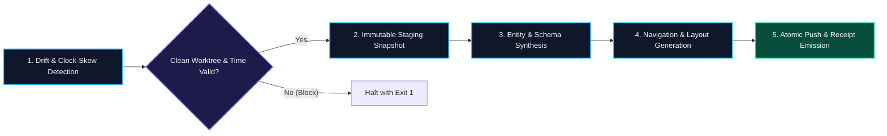

# Deterministic Sync Pipeline

The **Deterministic Sync Pipeline** is the core state management and publication protocol of **KB-Sync**. It ensures that all synchronizations between local checkouts, Obsidian vaults, NotebookLM, and remote GitHub Wikis are repeatable, idempotent, and backed by cryptographic verification receipts.

---

## 📐 Pipeline Stages & Invariants

---

## 🔒 The Five Determinism Guarantees

1. **Strict Timestamp Validation:**
   Timestamps must follow ISO-8601 UTC format. Any report or manifest with a future timestamp exceeding a 60-second threshold is rejected immediately as clock-skew.
2. **Worktree Cleanliness Guard:**
   Mutating operations require a clean Git working tree. Untracked and uncommitted files block automatic healing runs to prevent silent overwrites.
3. **Idempotent Manifest Hashing:**
   Staging directories are identified by SHA-256 manifest hashes. If a manifest hash has already been processed in `Log.md`, repeat runs are skipped unless `--force` is provided.
4. **Canonical Path Containment:**
   All read and write operations are strictly contained within verified repository roots, blocking directory traversal (`..`) and sandbox leakage.
5. **Cryptographic Proof Receipts (`.wiki-sync-receipt.json`):**
   Every publication emits a verifiable receipt recording local commit HEAD, remote wiki HEAD, timestamp, and published file counts.

---

## 🔗 Related Concepts
- [[pack-based-knowledge-management]] — Hermetic knowledge packaging
- [[fail-soft-orchestration]] — Tiered governance and safety gates
- [[immutable-staging]] — Staging directory contracts
