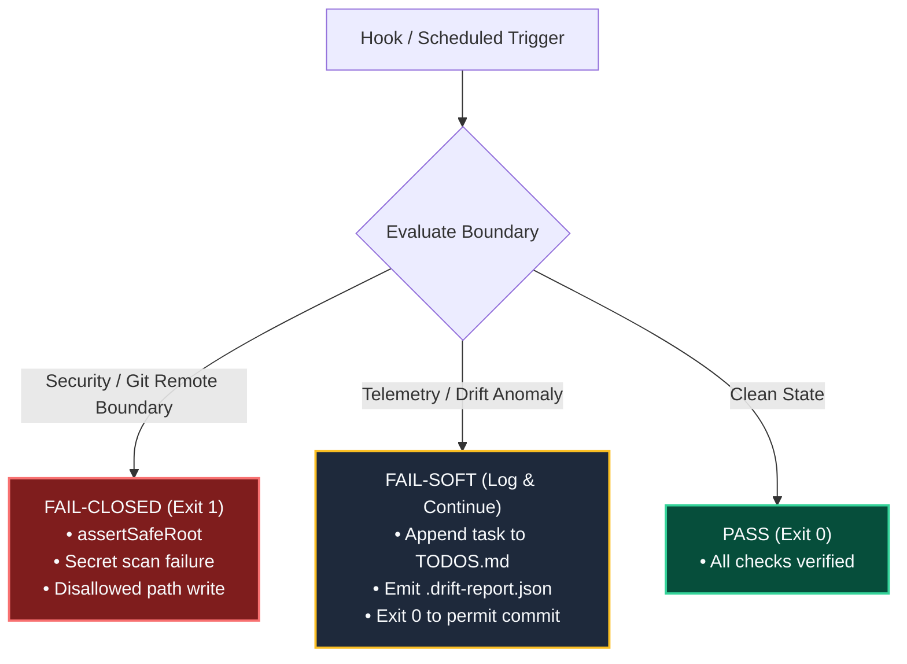

# Fail-Soft Orchestration

**Fail-Soft Orchestration** is the operational safety pattern governing all automated background daemons, scheduled tasks, and Git hooks across KB-Sync and the wider Toolforge ecosystem.

---

## 🛡️ Core Philosophy

Automated maintenance tasks (autoheal sweepers, background indexing, telemetry collection) should **never block or corrupt primary developer workflows** when non-critical anomalies arise, while strictly failing closed on safety and security boundaries.

---

## 🚦 Tier Classification & Behavior

| Tier | Boundary Type | Failure Behavior | Example |
|---|---|---|---|
| **Tier 1 (Security & Isolation)** | Git remotes, path escapes, credential safety | **Fail-Closed (Exit 1)** | `assertSafeRoot` blocking git pushes from research vaults; path traversal rejections. |
| **Tier 2 (Integrity & Schema)** | Markdown contract validation, schema conformity | **Fail-Closed (Exit 1)** in CI, **Warning** in local hook | Missing required frontmatter fields during pull request review. |
| **Tier 3 (Drift & Background Sync)** | Telemetry collection, sibling documentation sync | **Fail-Soft (Exit 0)** + `TODOS.md` logging | Code file modified without immediate doc sibling; logs task to `TODOS.md` without halting commit. |

---

## 🔗 Related Concepts
- [[deterministic-sync-pipeline]] — Deterministic pipeline invariants
- [[karpathy-llm-wiki-pattern]] — Automated distillation workflows
