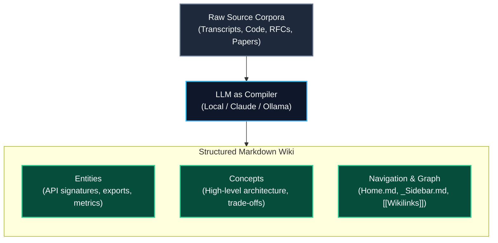

# Karpathy LLM-Wiki Pattern

The **Karpathy LLM-Wiki Pattern** models knowledge distillation as a compilation pipeline where **raw, noisy source corpora are compiled by LLMs into structured, interconnected markdown wiki nodes**.

---

## 📐 The Compilation Model

---

## 🔑 Key Tenets

1. **Source Documents are Immutable:** Raw inputs are never edited; they are analyzed and cited.
2. **Wiki Pages are Living Compilations:** When source files change, the corresponding wiki nodes are re-synthesized or patched.
3. **Hyperlinked Semantic Web:** Concepts and entities reference each other via `[[Wikilinks]]`, creating an interconnected knowledge graph.
4. **Automated Auditability:** Every synthesized page carries a frontmatter contract with citations and source SHA-256 hashes.

---

## 🔗 Related Concepts
- [[pack-based-knowledge-management]] — Packaging source inputs
- [[local-context-cache]] — Zero-cloud local embedding substrate
- [[trm-closed-loop-research]] — Closed-loop research gap resolution
