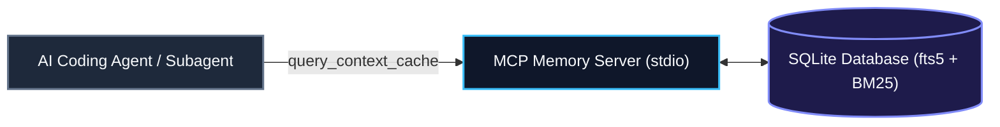

# Local Context Cache

The **Local Context Cache** is a zero-cloud, embedded SQLite knowledge engine (`knowledge.db`) providing ultra-fast semantic and full-text retrieval across all repository documents and entity specifications.

---

## 🏛️ Architectural Overview

The Local Context Cache indexes markdown and JSON documentation into an embedded SQLite database using `fts5` full-text BM25 search. An MCP stdio server exposes `query_context_cache` and `fetch_topic_note` tools to interactive agents.

---

## 🛠️ MCP Tool Interface

- `query_context_cache(query: string, limit?: number)`: Executes ranked BM25 queries across all indexed topic nodes.
- `fetch_topic_note(topic_id: string)`: Retrieves the complete markdown content and citation metadata for a specific topic note.

---

## 🔗 Related Concepts
- [[deterministic-sync-pipeline]] — Deterministic sync pipeline
- [[trm-closed-loop-research]] — TRM closed-loop research
