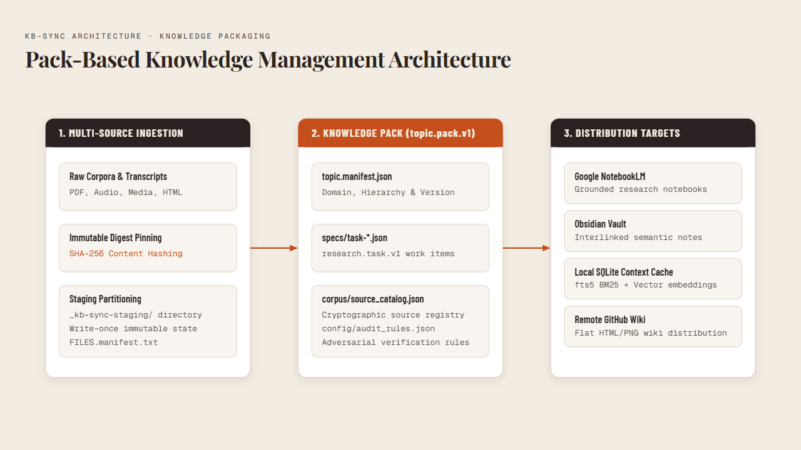
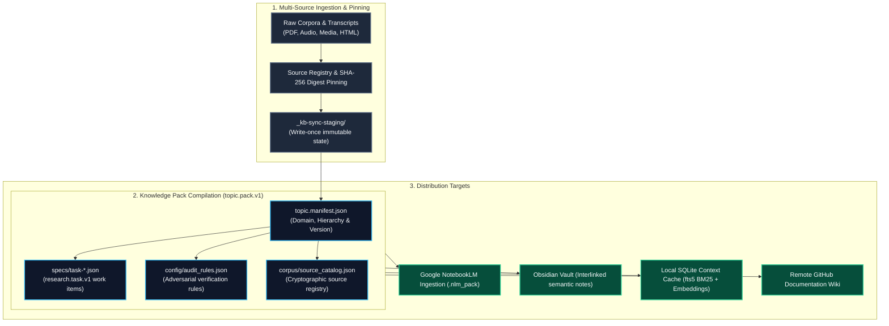

# Pack-Based Knowledge Management

**Type:** Core Architecture Specification
**Domain:** kb-sync | storage | packing | distribution
**Status:** Active
**Last Updated:** 2026-08-30

---

## Overview & Definition

**Pack-Based Knowledge Management** is the hermetic distribution and encapsulation architecture used across the **KB-Sync** and **Cast Iron Charlie (CIC)** ecosystems. It organizes heterogeneous raw research corpora, audio transcripts, structural schemas, and vector embeddings into standardized, self-contained, offline-first knowledge packs (`.nlm_pack/`, `topic.pack.v1`).

---

## ⚡ Architecture Diagram



<details>
<summary>Mermaid source (kept for editing — the image above is what renders on the wiki)</summary>



</details>

---

## 📦 Core Pack Specifications

A standardized topic pack contains three mandatory specification surfaces:

### 1. `topic.manifest.json`
Declares the root identity, parent-child topic hierarchy, and version contract:
```json
{
  "schema": "topic.pack.v1",
  "slug": "cuba-expropriations",
  "title": "Cuban Land Seizures & Agricultural Holdings",
  "version": "1.0.0",
  "domain": "cast-iron-charlie",
  "created_at": "2026-08-30T00:00:00Z"
}
```

### 2. `specs/task-*.json` (`research.task.v1`)
Atomic work items dispatched to local and remote extraction models. Each task locks its input evidence, required entity extractions, and temporal validation constraints.

### 3. `corpus/source_catalog.json`
Cryptographic catalog of all raw documents in the pack, recording:
- Original URI / provenance
- Local relative storage path
- File size and MIME type
- SHA-256 content digest

---

## 🔒 Operational Guarantees

1. **Hermetic Reproducibility:** Every extraction, summary, or gap triage finding can be traced back to the exact byte-level SHA-256 hash of its source document in the pack.
2. **Offline-First Resilience:** Knowledge packs can be synced, queried, and verified without external network access.
3. **Multi-Target Portability:** A single pack compiles into Obsidian Markdown nodes, NotebookLM upload packages, SQLite vector stores, or GitHub Wiki pages.

---

## 🔗 Related Architecture Guides
- [[deterministic-sync-pipeline|Deterministic Sync Pipeline]] — Strict SHA-256 state tracking and staging
- [[karpathy-llm-wiki-pattern|Karpathy LLM-Wiki Pattern]] — LLM distillation of raw pack sources
- [[local-context-cache|Local Context Cache]] — Zero-cloud local embedding substrate
- [[fail-soft-orchestration|Fail-Soft Orchestration]] — Tiered governance and safety gates
