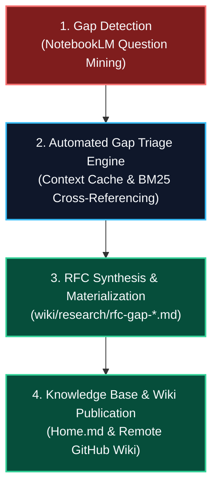

# TRM Closed-Loop Research

**TRM Closed-Loop Research** is the autonomous gap detection, triage, and RFC materialization workflow connecting **TRM** and **KB-Sync**.

---

## 🔄 The Closed-Loop Lifecycle

---

## 🛠️ Automated Triage Mechanics

1. **Gap Ingestion:** `trm-research-gaps.md` records surfaced historical or factual ambiguities.
2. **Context Cross-Referencing:** The triage engine queries `knowledge.db` to locate matching primary sources.
3. **RFC Generation:** Drafts structured decision RFCs with citation tables and open research questions.
4. **Approval Materialization:** Approved RFCs are incorporated into the canonical knowledge pack.

---

## 🔗 Related Concepts
- [[local-context-cache]] — Embedded context retrieval
- [[pack-based-knowledge-management]] — Knowledge pack structure
