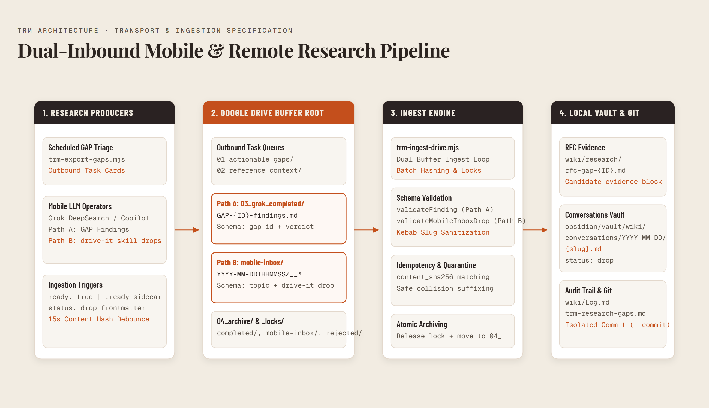
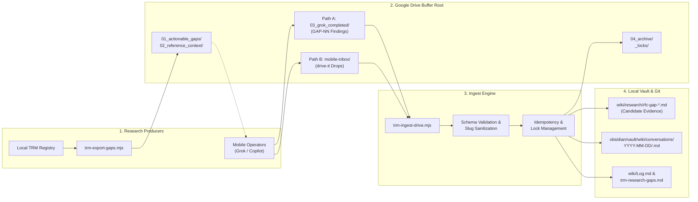

# TRM Google Drive Transport Adapter Architecture & Operator Specification

**Version:** 2.5  
**Authority Reference:** Locked 2026-09-20 TRM Git Write Authority Model  
**Module:** `kb-sync` (`scripts/trm-drive-common.mjs`, `scripts/trm-export-gaps.mjs`, `scripts/trm-ingest-drive.mjs`, `scripts/trm-review-queue.mjs`)

---

## 1. Executive Summary & Goals

The TRM Google Drive Transport Adapter provides an asynchronous, out-of-band communication bridge between local knowledge-base orchestration and remote/mobile LLM research agents (such as Grok Mobile, DeepSearch, Microsoft 365 Copilot, and Copilot Chat).

The system enables zero-token, high-capacity mobile research workflows without compromising repository integrity or bypassing strict Git-tracked provenance rules.

---

## 2. Core Architectural Invariants

1. **Single Git Write Authority**: Git-tracked markdown files (`wiki/research/rfc-gap-*.md`, `trm-research-gaps.md`, and `wiki/Log.md`) are the sole canonical truth. Derived databases (SQLite, caches) are strictly secondary and downstream.
2. **Inbound Status Invariant**: Remote agent findings arrive as candidate evidence (`provenance_type: remote_agent_finding`, `verification_status: inferred`, `not_primary_evidence: true`). Automated ingest pipelines never mark a research gap as `resolved`.
3. **Frozen Identifier Pattern**: All gap identifiers must strictly match `^GAP-[0-9]{2,3}(-[A-Z0-9]+)?$` (e.g., `GAP-03-VIDEOS`, `GAP-00-FIXTURE`, `GAP-001-V2`, `GAP-000`).
4. **Delimited Finding Identity**: Finding IDs are cryptographically derived using the unit separator byte (`0x1f`):
   $$\text{finding\_id} = \text{SHA-256}(\text{gap\_id} \mathbin{\Vert} \mathtt{0x1f} \mathbin{\Vert} \text{canonical\_payload\_sha256})$$
   This prevents delimiter and prefix collision attacks across variable-length identifiers.
5. **Ingestion Commit Isolation**: Ingestion runs dirty by default. When `--commit` is explicitly specified, Git commits are isolated strictly to the touched files (`git commit --only -- <rfc> <registry> <log>`) and fail closed on existing `.git/MERGE_HEAD` or pre-commit hook aborts.
6. **Ready Signal Precedence**: Ingestion detects file readiness via a strict precedence ladder:
   $$\text{sidecar } (.ready) > \text{frontmatter } (ready: true) > \text{filename } (.READY.) > \text{gdoc\_title } (\text{" READY"})$$
7. **Context Redaction**: Outbound context packs are sanitized against deny-list regular expressions filtering email addresses, phone numbers, local filesystem paths, and private investigative logs.

---

## 3. Directory Layout & Buffer Root Structure

The Google Drive buffer root (`drive_buffer_root`, default: `G:/My Drive/TRM-Research`) contains six functional folders across two inbound paths:

```
TRM-Research/
├── 01_actionable_gaps/     # Outbound task cards (GAP-{ID}.md)
├── 02_reference_context/   # Redacted context packs (GAP-{ID}-context-pack.md)
├── 03_grok_completed/      # Inbound mobile research findings awaiting ingestion (Path A)
├── mobile-inbox/           # Inbound unscheduled research drops from drive-it (Path B)
├── 04_archive/             # Processed items
│   ├── completed/          # Ingested findings (timestamped)
│   ├── mobile-inbox/       # Ingested mobile drops (timestamped)
│   ├── gaps/               # Ingested outbound cards
│   └── rejected/           # Malformed or unauthenticated payloads
└── _locks/                 # Active research leases (GAP-{ID}.lease-{agent})
```

---

## 4. Operational Pipeline Flow



<details>
<summary>Mermaid source...</summary>



</details>

1. **Export**: Priority-ordered actionable gaps (`HIGH`, `MEDIUM`) are exported as structured YAML-frontmatter cards with corresponding redacted context packs.
2. **Execution**:
   - **Path A (Scheduled GAP research)**: Remote mobile operators inspect tasks in `01_actionable_gaps/`, read reference context, conduct web and database research, and write structured findings (`gap_id`, `ready: true`) to `03_grok_completed/`.
   - **Path B (Unscheduled research drops)**: Mobile Grok operators run `drive-it` drops (`topic`, `status: drop`) directly into `mobile-inbox/`.
3. **Ingest**: Local ingestion batches files, applies content-hash debounce (15s default), validates schemas and finding IDs, appends candidate evidence blocks to `wiki/research/rfc-{gap_id}.md` (Path A) or writes daily conversation files to `obsidian/vault/wiki/conversations/YYYY-MM-DD/<slug>.md` (Path B), logs audit records to `wiki/Log.md`, and archives processed artifacts to `04_archive/`.
4. **Promotion**: Human reviewers evaluate candidate evidence using `node scripts/trm-review-queue.mjs` and promote verified findings via `trm-review-queue.mjs promote --gap=<GAP_ID> --finding=<FINDING_ID>`.


---

## 5. Mobile Operator Playbook (§10)

This section provides clear, step-by-step guidance for mobile operators executing research using Grok Mobile, DeepSearch, or Microsoft Copilot.

### Step 1: Claiming a Gap Task
1. Open the `01_actionable_gaps/` folder on Google Drive.
2. Select the highest priority gap card (e.g., `GAP-03-VIDEOS.md`).
3. Optional: Create a lease file in `_locks/` named `GAP-03-VIDEOS.lease-grok` to prevent duplicate effort.

### Step 2: Reviewing Reference Context
1. Open the companion context file in `02_reference_context/GAP-03-VIDEOS-context-pack.md`.
2. Inspect prior knowns, open contradictions, docket numbers, or accession strings.

### Step 3: Conducting LLM Research
- Query LLM tools (e.g. Grok DeepSearch, Copilot Web Search) focusing on primary accession records, corporate filings, government dockets, and historical archives.
- Ensure all factual claims preserve verbatim citations: `[1]`, `[cite: ...]`, or explicit markdown URLs (`[Archive](https://...)`).

### Step 4: Formatting the Finding Payload
Save your finding markdown document in `03_grok_completed/` (e.g., `GAP-03-VIDEOS-findings.md`) with valid YAML frontmatter:

```markdown
---
gap_id: "GAP-03-VIDEOS"
agent_origin: "grok"
agent_version: "grok-mobile"
source_type: "web"
verdict: "CONFIRMED"
verification_status: "inferred"
provenance_type: "remote_agent_finding"
not_primary_evidence: true
ready: true
---

# Findings Summary
Primary docket CU-0000 confirms registration [1].
Cross-referenced against SEC determination filings [cite: 3, 7].
```

### Step 5: Signaling Completion
Ensure the ready signal is active using any of the four supported methods:
1. Touch sidecar file: `03_grok_completed/GAP-03-VIDEOS-findings.ready` (Preferred).
2. Set frontmatter: `ready: true` in the document header.
3. Rename file with marker: `GAP-03-VIDEOS-findings.READY.md`.
4. Append title marker: `GAP-03-VIDEOS Findings READY` for native Google Docs.

---

## 6. Review & Evidence Promotion Workflow

To inspect and promote findings locally:

1. **List Pending Candidates**:
   ```bash
   node scripts/trm-review-queue.mjs --json
   ```

2. **Promote Verified Evidence**:
   ```bash
   node scripts/trm-review-queue.mjs promote --gap=GAP-03-VIDEOS --finding=<FINDING_SHA256>
   ```

3. **Verify Git Diff & Finalize RFC**:
   ```bash
   git diff wiki/research/rfc-gap-03-videos.md
   ```

---

## 7. Automation Cadence & Execution Windows

| Window | Component / Task | Action | Target / Directory |
|---|---|---|---|
| **20:30 ET (Daily)** | `KB-Sync-TRM-Triage` | Main TRM gap triage & daily outbound drop | `01_actionable_gaps/`, `02_reference_context/` |
| **21:30 ET (Daily)** | Grok Remote Job | Mobile research worker claims 1 gap | `03_grok_completed/` |
| **Every 4 Hours** | `\Ironbots\TRM-Drive-Sync` | Transport ingest & archive loop | Ingests from `03_grok_completed/` to RFCs |
| **On Demand** | Human Reviewer | Manual candidate promotion | `scripts/trm-review-queue.mjs` |

